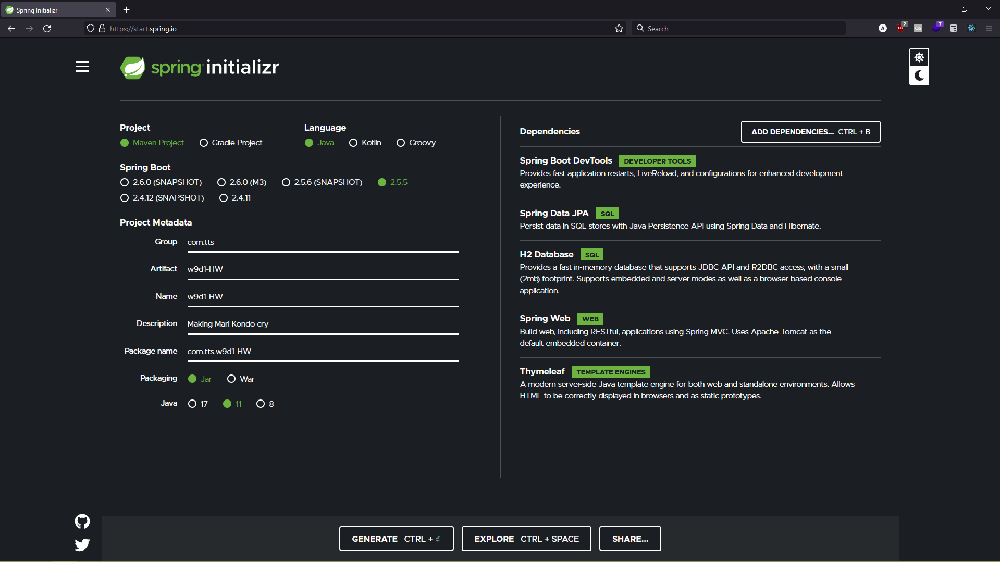
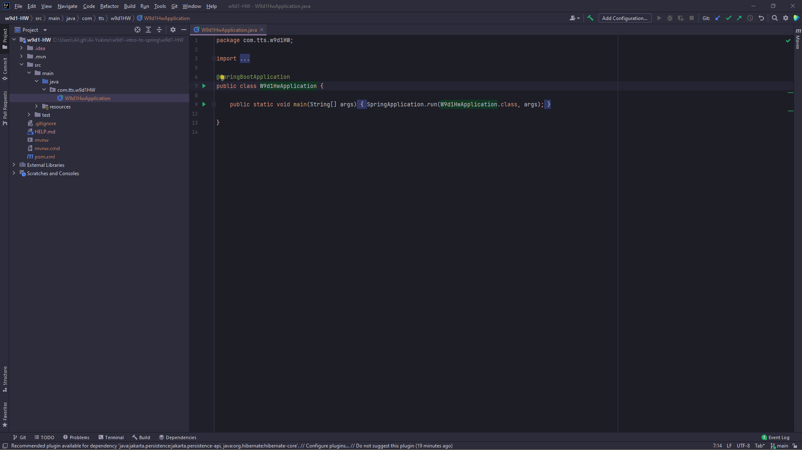
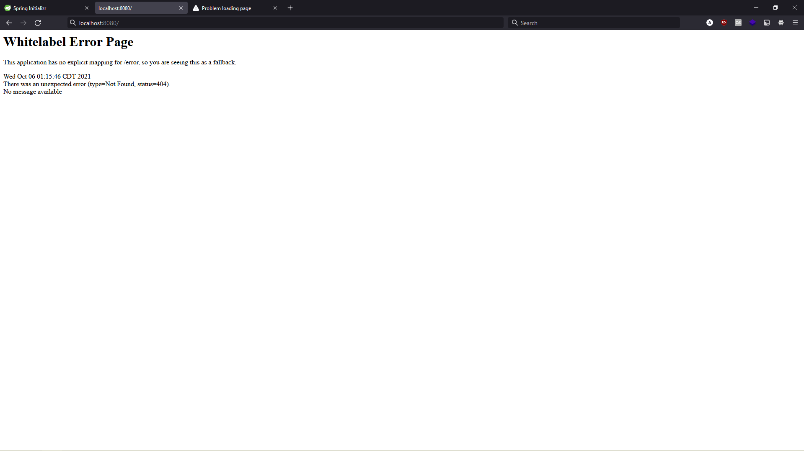
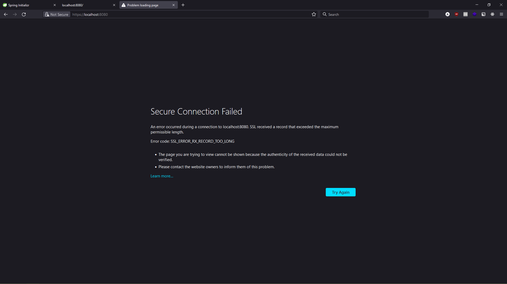

# How-to

## spring initializr + IntelliJ

Run [spring initializr](https://start.spring.io/) with the following dependencies:

- Spring Boot DevTools
- Spring Data JPA
- H2 Database
- Spring Web
- Thymeleaf

So something like [this](https://start.spring.io/#!type=maven-project&language=java&platformVersion=2.5.5&packaging=jar&jvmVersion=11&groupId=com.tts&artifactId=w9d1-HW&name=w9d1-HW&description=Making%20Mari%20Kondo%20cry&packageName=com.tts.w9d1-HW&dependencies=devtools,data-jpa,h2,web,thymeleaf):



Generate a configured Spring project file by clicking the `Generate` button on the bottom left or typing `CTRL + Enter (return)`.
Save the zip file and unzip this file.
Open IntelliJ and then open the project folder inside the unzipped folder.

## Quick test (no "hello world")

After IntelliJ has initialized your project, run your project without making any changes.
For example, click the green arrow next to `public class {ProjectName}Application` that is inside folders like

```
src/main/java/com.{ProjectURL}/{ProjectName}Application
```



Then navigate to [localhost:8080/](localhost:8080/)
or [http://localhost:8080/](http://localhost:8080/). You should see an error page like this:



Going to [https://localhost:8080/](https://localhost:8080/) with and `s`, i.e. `https://...`, might give you a different error such as:



but you shoud try one of the first two links.
Once you see the "whitelabel error page", then go back to IntelliJ and stop running your program.

## Set up database, form, and submission page

We'll make a database via Java.
Then we'll use [Thymeleaf](https://en.wikipedia.org/wiki/Thymeleaf) to make an HTML form page and form submissions page.
After this section we'll link them togther via a Java controller.

### Make a database

Right click the package that looks like `main\java\com.{...}`, and create a class for your database, e.g. `{DatabaseName}`.
Open that Java class file, e.g. `{DatabaseName}.Java`.
Add a

```
@Entity
```

entity annotation on the line above the class delcaration `public class {Database name} () { ...`.
Inside the class, decalre a variable to hold your database's primary key. Annotate it with `@Id` and make sure to import that annotation.
So something like

```
@Id
private long id
```

Declare other variables corresponding to the columns of your database, e.g. `private String firstName`, `private boolean isRegistered`, or `private Double accountBalance`.
No annotations are needed for these variables.

Declare an empty constructor. Also declare setters and getters as well as overriding the `toString()` method (e.g. via right-clicking and selecting `Generate` or hitting `alt + insert`).

### Make a form

I'm not sure exactly how Thymeleaf templates work, but you start by copying this [example template](https://github.com/PTroyP/handling_form_submission/blob/main/initial/src/main/resources/templates/greeting.html) from Troy's class project on Tuesday.
To link CSS and JS to your template-generated HTML file, add those files to `resources/static` and then include something like

```
<link th:href="@{/style.css}" rel="stylesheet" />
```

to the `<head>...</head>` in your Thymeleaf templates.
You can read more [here](https://www.baeldung.com/spring-thymeleaf-css-js) to learn more about setting up CSS and JS with Thymeleaf.
The name of the template file should be something like `{formName}.html`. Add this template page to `resources/static/templates`.

### Make a form submission page

Copy and modify the template from [here](https://github.com/PTroyP/handling_form_submission/blob/main/initial/src/main/resources/templates/result.html).
Name your template file something like `{resultName}.html`.
Add the template page to `resources/static/templates`.

## Link together database, form, and submission page

Right-click

```
src/main/java/com.{ProjectURL}/{ProjectName}Application
```

and create a `controllers` package.
Right-click this package and create a `{DatabaseName}Controller` class.

Add a `@Controller` annotation above the class declaration, e.g. something like

```
@Annotation
public class {DatabaseName}Controller() {...
```

Make sure to import the `@Controller` annotation!
Inside we'll two controller methods: one to handle a `GET` request from the form and one to handle a `POST` request for the submission page.
I'm not sure how to explain it clearly, but again follow along with Troy's [example](https://github.com/PTroyP/handling_form_submission/blob/main/initial/src/main/java/com/example/handlingformsubmission/Greeting.java) on Tuesday.

## Configure application.properties

In `resources/application.properties`, paste in

```
spring.h2.console.enabled=true
spring.h2.console.path=/console

# From section 3 on
# https://www.baeldung.com/spring-boot-h2-database
# Enter this in console under "JDBC URL:"
spring.datasource.url=jdbc:h2:mem:testdb
# Data saves on application restart
#spring.datasource.driverClassName=org.h2.Driver
spring.datasource.username=sa
#spring.datasource.password=password
#spring.jpa.database-platform=org.hibernate.dialect.H2Dialect
# Run this to add entries into database
#INSERT INTO customer(id, first_name, last_name) values(1, 'John', 'Smith');
#INSERT INTO customer(id, first_name, last_name) values(2, 'Jane', 'Doe');
#SELECT * FROM customer;
```

The first two lines enable use to run SQL queries by going to `localhost:8080/console`.
The other lines are an attempt at trying to get the data to persist across application reloads, but it doesn't seem to work.
